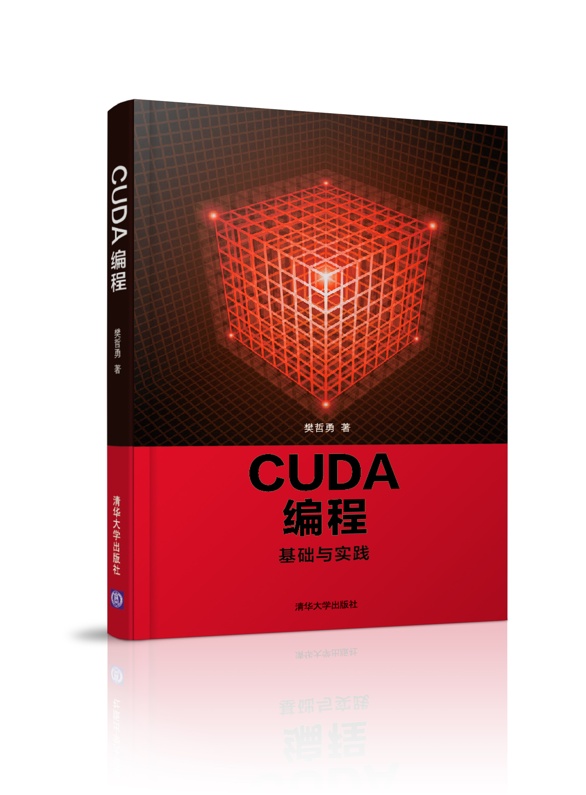

# 目录和源代码条目

## 第 1 章：GPU 硬件和 CUDA 工具

本章无源代码。

## 第 2 章：`CUDA` 中的线程组织

| 文件       | 知识点 |
|:------------|:---------------|
| `hello.cpp` | 用 `C++` 写一个 Hello World 程序 |
| `hello1.cu` | 一个正确的 `C++` 程序也是一个正确的 `CUDA` 程序 |
| `hello2.cu` | 写一个打印字符串的 `CUDA` 核函数并调用 |
| `hello3.cu` | 使用含有多个线程的线程块 |
| `hello4.cu` | 使用多个线程块 |
| `hello5.cu` | 使用两维线程块 |

## 第 3 章：`CUDA` 程序的基本框架

| 文件        | 知识点 |
|:------------|:---------------|
| `add.cpp`      | 数组相加的 `C++` 版本 |
| `add1.cu`      | 数组相加的 `CUDA` 版本 |
| `add2wrong.cu` | 如果数据传输方向搞错了会怎样？ |
| `add3if.cu`    | 什么时候必须在核函数使用 if 语句？ |
| `add4device.cu`| 定义与使用 `__device__` 函数 |

## 第 4 章：`CUDA` 程序的错误检测

| 文件       | 知识点 |
|:------------|:---------------|
| `check1api.cu`    | 检测 `CUDA` 运行时 API 函数的调用 |
| `check2kernel.cu` | 检测 `CUDA` 核函数的调用 |
| `memcheck.cu`     | 用 `cuda-memcheck` 检测内存方面的错误 |
| `error.cuh`       | 本书常用的用于检测错误的宏函数 |

## 第 5 章：获得 GPU 加速的前提

| 文件       | 知识点 |
|:------------|:---------------|
| `add1cpu.cu`    | 为 `C++` 版的数组相加函数计时 |
| `add2gpu.cu`    | 为数组相加核函数计时 |
| `add3memcpy.cu` | 如果把数据传输的时间也包含进来，还有加速吗？|
| `arithmetic1cpu.cu`       | 提高算术强度的 `C++` 函数 |
| `arithmetic2gpu.cu`       | 提高算术强度的核函数；GPU/CPU 加速比是不是很高？ |

## 第 6 章： `CUDA` 中的内存组织

| 文件        | 知识点 |
|:------------|:---------------|
| `static.cu`    | 如何使用静态全局内存 |
| `query.cu`     | 如何在 CUDA 程序中查询所用 GPU 的相关技术指标 |

## 第 7 章：全局内存的合理使用

| 文件        | 知识点 |
|:------------|:---------------|
| `matrix.cu` | 合并与非合并读、写对程序性能的影响 |

## 第 8 章：共享内存的合理使用

| 文件        | 知识点 |
|:------------|:---------------|
| `reduce1cpu.cu`     | `C++` 版本的归约函数 |
| `reduce2gpu.cu`     | 仅使用全局内存和同时使用全局内存和共享内存的归约核函数|
| `bank.cu`           | 使用共享内存实现矩阵转置并避免共享内存的 bank 冲突 |

## 第 9 章：原子函数的合理使用

| 文件        | 知识点 |
|:------------|:---------------|
| `reduce.cu`        | 在归约核函数中使用原子函数 `atomicAdd` |
| `neighbor1cpu.cu`  | CPU 版本的邻居列表构建函数 |
| `neighbor2gpu.cu`  | GPU 版本的邻居列表构建函数，分使用和不使用原子函数的情况 |

## 第 10 章: 线程束内部函数
| 文件        | 知识点 |
|:------------|:---------------|
| `reduce.cu` | 线程束同步函数、线程束洗牌函数以及协作组的使用 |
| `reduce1parallelism.cu` | 提高线程利用率 |
| `reduce2static.cu` | 利用静态全局内存加速  |

## 第 11 章： `CUDA` 流
| 文件        | 知识点 |
|:------------|:---------------|
| `host-kernel.cu`     | 重叠主机与设备计算 |
| `kernel-kernel.cu`   | 重叠核函数之间的计算 |
| `kernel-transfer.cu` | 重叠核函数执行与数据传输 |

## 第 12 章：统一内存
| 文件       | 知识点 |
|:------------|:---------------|
| `add.cu` | 使用统一内存可以简化代码 |
| `oversubscription1.cu` | 统一内存在初始化时才被分配  |
| `oversubscription2.cu` | 用 GPU 先访问统一内存时可以超过显存的容量 |
| `oversubscription3.cu` | 用 CPU 先访问统一内存时不可超过主机内存容量 |
| `prefetch.cu` | 使用 cudaMemPrefetchAsync 函数 |

## 第 13 章：分子动力学模拟（MD）
| 文件夹        | 知识点 |
|:------------|:---------------|
| `cpp`     | C++ 版本的 MD 程序 |
| `force-only`   | 仅将求力的函数移植到 CUDA |
| `whole-code` | 全部移植到 CUDA |

## 第 14 章：CUDA 库
| 文件        | 知识点 |
|:------------|:---------------|
| `thrust_scan_vector.cu`  | 使用 `thrust` 中的设备矢量 |
| `thrust_scan_pointer.cu` | 使用 `thrust` 中的设备指针 |
| `cublas_gemm.cu`         | 用 `cuBLAS` 实现矩阵相乘 |
| `cusolver.cu`            | 用 `cuSolver` 求矩阵本征值 |
| `curand_host1.cu`        | 用 `cuRAND` 产生均匀分布的随机数 |
| `curand_host2.cu`        | 用 `cuRAND` 产生高斯分布的随机数 |
